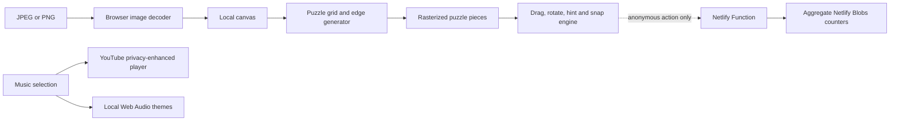

<div align="center">
  
  <h1>Keepsake</h1>
  <p><strong>Turn a favorite photo into a private, tactile jigsaw puzzle—right in your browser.</strong></p>
  <p>
    <a href="https://github.com/MANISH007700/keepsake-jigsaw"></a>
    
    
    
    
  </p>
</div>

---

## About the project

Keepsake is a browser-based jigsaw experience built around memories rather than stock puzzle images. Choose a JPEG or PNG, select a challenge, and rebuild the image piece by piece with optional rotation, guided hints, a timer, sound effects, and an emotional soundtrack.

The core privacy promise is simple: **the selected photo is decoded and processed locally in the browser. It is never uploaded to the application server, analytics endpoint, or Netlify Blobs.**

## Highlights

| Area | What Keepsake offers |
| --- | --- |
| Private photos | Image decoding, cutting, rendering, and puzzle play happen on the user's device |
| Flexible puzzles | Presets for 12, 30, 50, and 100 pieces, plus a custom range from 8–150 |
| Three difficulties | Easy, Medium, and Hard modes with different guides, snap tolerance, hints, and rotation behavior |
| Tactile piece tray | Switch between a natural pile scramble and a neat spread that keeps pieces visible |
| Guided hints | Highlights a piece to pull and pulses over its exact destination on the board |
| Rotation | Optional 90° piece rotation; required in Hard mode |
| Timing | Optional elapsed timer, automatic pause when the tab is hidden, and session-best results |
| Sound design | Pickup, miss, snap, shuffle, rotate, hint, pause, resume, timer, and completion sounds |
| Music | Sparkle, Homecoming, and Memory Lane at full in-app output |
| Responsive play | Desktop and mobile layouts designed to keep the board and tray usable without piece-list scrolling |
| Appreciation | A session-safe Clap button with an aggregate counter |
| Product analytics | Anonymous aggregate visits, five-minute engagement, starts, completions, hints, claps, solve time, difficulty, and piece-count mix |
| Installable experience | Web app manifest, favicon, theme colors, and a small service worker cache |

## Difficulty modes

### Easy

- Strong visual guidance
- Wider snap tolerance
- Unlimited guided hints
- Rotation is optional

### Medium

- Piece outlines and balanced snap tolerance
- Unlimited guided hints
- Rotation is optional

### Hard

- Rotation is required
- Three guided hints per puzzle
- More demanding placement behavior

## Music and sound

Keepsake deliberately uses audio as part of the emotional experience:

1. **Sparkle** — the default soundtrack, played through a visibly attributed, privacy-enhanced YouTube embed of *Sparkle — Your Name OST [Piano]* by Animenz Piano Sheets.
2. **Homecoming** — a hopeful local piano-and-violin soundscape generated with the Web Audio API.
3. **Memory Lane** — a tender local piano-and-violin soundscape generated with the Web Audio API.

The YouTube player and the local Web Audio master output are set to **100%**. Listeners control the final loudness with their phone, laptop, headphones, or speakers. Browsers may block unmuted automatic playback; if that happens, the player displays a clear prompt to press Play once. See the [YouTube IFrame Player API reference](https://developers.google.com/youtube/iframe_api_reference) for player and autoplay behavior.

> Sparkle requires an internet connection and is streamed from YouTube. Homecoming, Memory Lane, and interaction sounds are generated locally and do not require an audio file download.

## How it works



The photo path and analytics path are intentionally separate. Analytics events never contain the photo, filename, a persistent user ID, or other personal information.

## Privacy model

### What stays on the device

- Selected photo bytes
- Decoded image canvas
- Rasterized puzzle pieces
- Puzzle layout and in-progress state
- Session clap guard

### What the analytics endpoint receives

- An allowed action name
- Difficulty and piece count for puzzle starts
- Solve duration for timed completions
- No filename, image content, account, email, cookie-based user profile, or persistent identifier

### Third-party music

Sparkle uses `youtube-nocookie.com` and an official YouTube embedded player. The player is visibly attributed and can be opened directly on YouTube. Selecting Homecoming or Memory Lane removes the YouTube player and uses the local Web Audio engine instead.

## Analytics dashboard

Open `/analytics` on a Netlify deployment to view aggregate product metrics.

| Metric | Definition |
| --- | --- |
| Visits | Puzzle-page sessions; not deduplicated unique people |
| Stayed 5+ min | Sessions with at least five minutes of visible-page time |
| Five-minute rate | Stayed 5+ min divided by visits |
| Claps | Appreciation actions, limited to one per browser-tab session |
| Puzzles started | New puzzle starts and re-scrambles |
| Puzzles completed | Sessions in which the final piece successfully snapped into place |
| Completion rate | Completed puzzles divided by started puzzles |
| Photos selected | Count of photo-selection actions only; the image and filename are not recorded |
| Pieces placed | Successful piece snaps |
| Hints used | Guided hint activations across all difficulty levels |
| Average solve time | Average duration across timed completions |

The dashboard also includes 14-day activity, difficulty mix, and puzzle-size mix. Aggregate totals are stored in Netlify Blobs with compare-and-set writes to reduce lost increments during concurrent traffic.

## Controls

| Action | Desktop | Mobile / touch |
| --- | --- | --- |
| Move a piece | Drag with the pointer | Drag with one finger |
| Select a piece | Click or begin dragging | Tap or begin dragging |
| Rotate | Select a piece and use **Rotate**, tap where enabled, or press `R` | Select a piece and use **Rotate** or tap where enabled |
| Arrange tray | **Pile scramble** or **Neat spread** | **Pile scramble** or **Neat spread** |
| Request help | Press **Hint** | Tap **Hint** |
| Pause | Press **Pause** | Tap **Pause** |
| Mute everything | Toggle **Sound** | Toggle **Sound** |

## Technology

- [Next.js 16](https://nextjs.org/) with static export
- [React 19](https://react.dev/) and TypeScript
- HTML Canvas for local image decoding and puzzle-piece rasterization
- Pointer Events for mouse, pen, and touch interaction
- Web Audio API for generated music and feedback sounds
- YouTube IFrame Player API for the attributed Sparkle soundtrack
- Netlify Functions for the analytics endpoint
- Netlify Blobs for aggregate counters
- Vitest and Testing Library for automated tests
- ESLint for static analysis

No database, authentication provider, image CDN, or image-upload service is required.

## Project structure

```text
app/
├── analytics/page.tsx       # Analytics route
├── globals.css              # Complete visual and responsive system
├── icon.svg                 # Favicon and PWA icon
├── layout.tsx               # Metadata, manifest, and viewport
└── page.tsx                 # Main application route

components/
├── AnalyticsDashboard.tsx   # Aggregate metrics dashboard
├── GameBoard.tsx            # Board, tray, pieces, hints, and interactions
├── Keepsake.tsx             # Main experience and application orchestration
├── SiteFooter.tsx           # Credits, portfolio, analytics link, and claps
└── YouTubeMusic.tsx         # Sparkle player and autoplay fallback

lib/
├── analytics-model.ts       # Event validation, aggregation, and migration
├── game.ts                  # Game state reducer and timing
├── image.ts                 # File validation and local image decoding
├── puzzle.ts                # Grid, edges, pieces, and rasterization
├── sound.ts                 # Web Audio music and sound effects
└── tray.ts                  # Pile and spread layout algorithms

netlify/functions/
└── analytics.mts            # GET/POST analytics function backed by Blobs

tests/                       # Analytics, game, puzzle, and tray tests
```

## Run locally

### Prerequisites

- Node.js 22 (matches the Netlify build configuration)
- npm

### Standard Next.js development

```bash
git clone https://github.com/MANISH007700/keepsake-jigsaw.git
cd keepsake-jigsaw
npm install
npm run dev
```

Open [http://localhost:3000](http://localhost:3000).

The complete puzzle experience works with `npm run dev`. The analytics endpoint is a Netlify Function, so `/analytics` will show its deployment notice unless the project is run through Netlify Dev.

### Full local Netlify environment

Install and authenticate the Netlify CLI, link the repository to a Netlify site, then start Netlify Dev:

```bash
npm install --global netlify-cli
netlify login
netlify link
netlify dev
```

Netlify Dev proxies the Next.js application and makes the function available under `/.netlify/functions/analytics`.

For more detail, see Netlify's guides for [installing the CLI](https://docs.netlify.com/api-and-cli-guides/cli-guides/get-started-with-cli/) and [running a local Netlify environment](https://docs.netlify.com/api-and-cli-guides/cli-guides/local-development/).

## Available commands

| Command | Purpose |
| --- | --- |
| `npm run dev` | Start the Next.js development server |
| `npm run build` | Produce the static export in `out/` |
| `npm run start` | Serve the exported `out/` directory |
| `npm run lint` | Run ESLint across the project |
| `npm test` | Run the Vitest suite once |
| `npm run test:watch` | Run tests in watch mode |

## Deploy to Netlify

The repository contains a complete [`netlify.toml`](./netlify.toml):

```toml
[build]
  command = "npm run build"
  publish = "out"
  functions = "netlify/functions"

[build.environment]
  NODE_VERSION = "22"
```

### Git-based deployment

1. Sign in to Netlify.
2. Choose **Add new project → Import an existing project**.
3. Select GitHub and choose `MANISH007700/keepsake-jigsaw`.
4. Keep the build settings from `netlify.toml`.
5. Deploy the site.

No application environment variables are required. The analytics function creates and accesses its named Netlify Blobs store through the Netlify runtime.

### CLI deployment

```bash
netlify login
netlify link
netlify build
netlify deploy
netlify deploy --prod
```

Use the preview URL returned by `netlify deploy` for a final check before publishing with `--prod`.

## Security and resilience

- Strict same-origin validation on analytics writes
- Allowlisted analytics payload shapes
- Content Security Policy restricted to the app and required YouTube embed origins
- Camera, microphone, and geolocation disabled through Permissions Policy
- `X-Content-Type-Options: nosniff`
- No photo uploads or server-side image processing
- Analytics failures are ignored by the puzzle client so gameplay remains available
- Service-worker cache versioning for returning visitors
- Reduced-motion support for visitors who prefer fewer animations

## Quality checks

Before opening a pull request or deploying, run:

```bash
npm run lint
npm test
npm run build
npm audit --omit=dev
```

The test suite covers analytics validation and migration, reducer behavior, puzzle generation, and tray layout rules.

## Known limitations

- Sparkle needs internet access and YouTube availability in the visitor's region.
- Browser autoplay rules may require one press on the embedded player before unmuted music starts.
- Visits are session counts, not unique-person counts.
- The service worker provides lightweight asset caching rather than a guaranteed fully offline puzzle session.
- Puzzle progress is intentionally ephemeral and is cleared by refreshing or closing the page.

## Contributing

Issues and focused pull requests are welcome:

1. Fork the repository.
2. Create a feature branch.
3. Add or update tests for behavior changes.
4. Run the quality checks above.
5. Open a pull request describing the user impact and validation performed.

## Author

Created by **Manish Sharma**.

- Portfolio: [manish-luci.netlify.app](https://manish-luci.netlify.app)
- GitHub: [@MANISH007700](https://github.com/MANISH007700)

## License

No open-source license is currently included. Unless a license is added, the repository remains under the copyright of its author.

---

<div align="center">
  <strong>Made for quiet moments—and the memories worth rebuilding.</strong>
</div>
